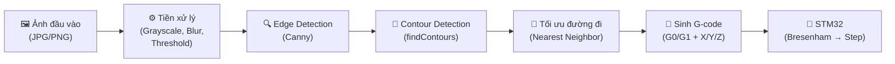
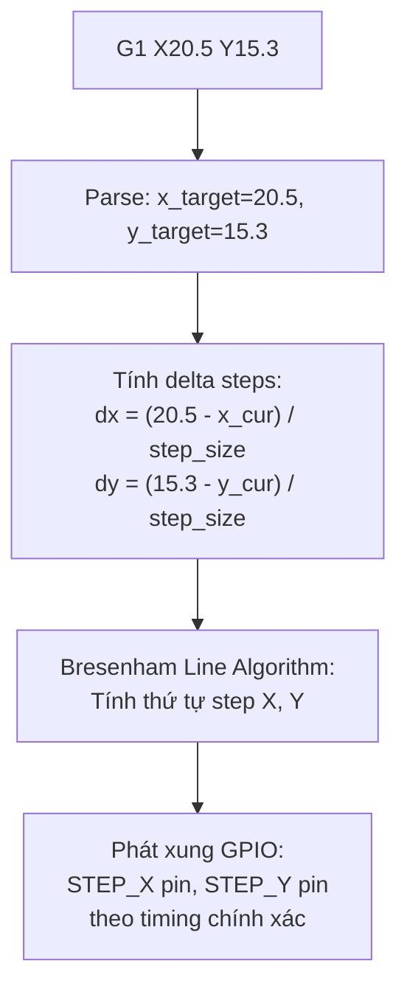
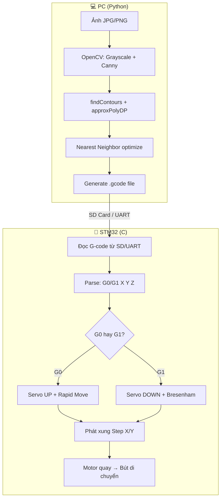

# Hướng Dẫn Chuyển Ảnh Sang G-code — CNC Drawing Robot (STM32)

## Phần cứng

| Thành phần | Vai trò |
|---|---|
| STM32 | Vi điều khiển chính, parse G-code, điều khiển step |
| 2x Stepper (DVD) | Trục X và Y (~40mm hành trình) |
| 2x A4988 | Driver điều khiển stepper (microstepping) |
| CNC Shield | Board kết nối driver + MCU |
| Servo SG90 | Điều khiển bút lên/xuống (trục Z) |

---

## 1. Tổng Quan Pipeline



### Vai trò từng bước

| Bước | Mục đích | Input → Output |
|---|---|---|
| Tiền xử lý | Loại bỏ noise, chuẩn hóa ảnh | Ảnh màu → Ảnh nhị phân |
| Edge Detection | Tìm biên của vật thể | Ảnh nhị phân → Ảnh cạnh |
| Contour Detection | Trích xuất đường viền thành tọa độ | Ảnh cạnh → List [(x,y)] |
| Tối ưu | Giảm thời gian di chuyển không vẽ | List contour → List contour đã sắp xếp |
| Sinh G-code | Tạo file lệnh cho CNC | List tọa độ → File .gcode |
| STM32 (Bresenham) | Chuyển tọa độ mm → xung step motor | G-code → Xung điện |

---

## 2. Chi Tiết Từng Bước

### Bước 1: Tiền xử lý ảnh

```
Ảnh gốc (RGB) 
    → Resize (max 500px, giữ tỷ lệ)
    → Grayscale (1 kênh, 0-255)
    → Gaussian Blur (giảm noise)
    → Threshold (nhị phân: 0 hoặc 255)
    → Canny Edge (tìm cạnh)
```

**Resize**: Stepper DVD chỉ ~40mm hành trình. Ảnh 4000px là thừa → resize về 500px giảm noise và tăng tốc xử lý.

**Grayscale**: CNC chỉ vẽ đường nét (có/không), không cần màu sắc.

**Gaussian Blur**: Làm mờ nhẹ loại bỏ noise nhỏ, tránh detect edge giả.

**Threshold**: Chuyển ảnh về trắng/đen thuần túy. Pixel > 127 → trắng, ≤ 127 → đen.

**Canny Edge**: Tìm biên dựa trên gradient. 2 ngưỡng (low=50, high=150) quyết định edge nào giữ.

```python
gray = cv2.cvtColor(img, cv2.COLOR_BGR2GRAY)
blurred = cv2.GaussianBlur(gray, (5, 5), 0)
_, binary = cv2.threshold(blurred, 127, 255, cv2.THRESH_BINARY_INV)
edges = cv2.Canny(blurred, 50, 150)
```

### Bước 2: Trích xuất contour

**Contour** = đường viền liên tục bao quanh vùng trắng/đen. OpenCV trả về list các điểm (x,y) trên đường viền.

```python
contours, _ = cv2.findContours(edges, cv2.RETR_LIST, cv2.CHAIN_APPROX_NONE)
```

**Xấp xỉ đa giác** (`approxPolyDP`): Contour thô có hàng ngàn điểm → dùng thuật toán Ramer-Douglas-Peucker giảm xuống vài chục điểm mà vẫn giữ hình dạng.

```python
# epsilon = 1.0: mỗi điểm cách đường xấp xỉ tối đa 1 pixel
approx = cv2.approxPolyDP(contour, epsilon=1.0, closed=False)
```

> [!TIP]
> `epsilon` nhỏ (0.5) → nhiều điểm, chi tiết nhưng chậm.
> `epsilon` lớn (3.0) → ít điểm, nhanh nhưng thô.
> Bắt đầu với 1.0, điều chỉnh theo kết quả.

**Lọc contour ngắn**: Bỏ contour < 10 pixel (noise).

### Bước 3: Tối ưu đường đi

Sau khi extract được N contour, thứ tự vẽ ảnh hưởng lớn đến thời gian:

**Vấn đề**: Nếu vẽ contour 1 ở góc trái-trên, contour 2 ở góc phải-dưới → motor phải chạy chéo mà không vẽ gì.

**Giải pháp — Nearest Neighbor**:
1. Bắt đầu từ (0,0)
2. Tìm contour có điểm đầu/cuối gần nhất
3. Vẽ contour đó (đảo chiều nếu điểm cuối gần hơn)
4. Lặp lại cho đến hết

```
Trước tối ưu: Travel = 450px (di chuyển không vẽ)
Sau tối ưu:   Travel = 120px (giảm 73%)
```

### Bước 4: Sinh G-code

**Mapping tọa độ**:
```
pixel (0..W, 0..H) → mm (0..BED_WIDTH, 0..BED_HEIGHT)

x_mm = (x_pixel / image_width) * 40.0
y_mm = ((image_height - y_pixel) / image_height) * 40.0
                     ↑ lật Y vì ảnh Y hướng xuống, CNC Y hướng lên
```

**Quy trình cho mỗi contour**:
```
1. Nâng bút lên    → G0 Z5
2. Di chuyển nhanh  → G0 X10.5 Y20.3    (đến điểm đầu contour)
3. Hạ bút xuống    → G1 Z0 F200
4. Vẽ từng đoạn    → G1 X11.2 Y21.0     (đoạn thẳng đến điểm tiếp)
                    → G1 X12.0 Y21.8
                    → ...
5. Hết contour → quay lại bước 1 cho contour tiếp
```

**Ví dụ G-code — vẽ hình tam giác**:
```gcode
; Header
G21        ; mm
G90        ; tọa độ tuyệt đối
G0 Z5      ; bút lên

; Contour 1: tam giác
G0 X0 Y0           ; di chuyển đến điểm A
G1 Z0 F200         ; hạ bút
G1 X20 Y0          ; vẽ A→B
G1 X10 Y17.32      ; vẽ B→C
G1 X0 Y0           ; vẽ C→A (đóng)

; Kết thúc
G0 Z5              ; bút lên
G0 X0 Y0           ; về gốc
M2                  ; end program
```

---

## 3. Liên Hệ Với Thuật Toán Bresenham

### Tại sao G-code phải là đoạn thẳng?

CNC controller (STM32) điều khiển motor **theo từng step (bước)**. Mỗi step = motor quay 1.8° = trục dịch ~0.01mm.

Để vẽ đường cong, ta **xấp xỉ bằng nhiều đoạn thẳng ngắn** — đây chính xác là điều `approxPolyDP` đã làm ở bước 2.

### Bresenham trên STM32

Mỗi lệnh `G1 X_new Y_new` yêu cầu STM32 vẽ **1 đoạn thẳng** từ vị trí hiện tại đến (X_new, Y_new). Thuật toán Bresenham giải quyết bài toán:

> *"Phải phát bao nhiêu xung cho motor X và motor Y, theo thứ tự nào, để đầu bút đi theo đường thẳng?"*

```
Ví dụ: G1 từ (0,0) → (5,3)
  dx = 5, dy = 3

Bresenham output (step sequence):
  Step 1: X+1        → (1,0)
  Step 2: X+1, Y+1   → (2,1)
  Step 3: X+1        → (3,1)
  Step 4: X+1, Y+1   → (4,2)
  Step 5: X+1, Y+1   → (5,3)  ✓ Done
```



### Mapping G-code → Step Motor

```
Thông số ổ DVD stepper (ví dụ):
  - Steps/revolution: 20
  - Lead screw pitch: 3mm/rev
  - → 1 step = 3mm / 20 = 0.15mm

Ví dụ: G1 X3.0 Y1.5  (từ X0 Y0)
  - X: 3.0mm / 0.15mm = 20 steps
  - Y: 1.5mm / 0.15mm = 10 steps
  → Bresenham(20, 10) → chuỗi xung cho 2 motor
```

> [!IMPORTANT]
> Bạn cần đo **steps_per_mm** thực tế của stepper DVD của mình. Công thức:
> `steps_per_mm = steps_per_revolution / lead_screw_pitch_mm`
> Giá trị này sẽ dùng trong firmware STM32 để convert mm → steps.

---

## 4. Code Python

File hoàn chỉnh đã được tạo tại: [image_to_gcode.py](file:///d:/BK/MyProject/CNC/image_to_gcode.py)

### Cách chạy

```bash
# Cài đặt thư viện
pip install opencv-python numpy

# Chạy với ảnh mặc định (image.jpg)
cd d:\BK\MyProject\CNC
python image_to_gcode.py

# Chạy với ảnh cụ thể
python image_to_gcode.py --input image1.png

# Tùy chỉnh vùng vẽ và độ chi tiết
python image_to_gcode.py --input image.jpg --width 40 --height 40 --epsilon 2.0
```

### Cấu trúc code

| Hàm | Vai trò |
|---|---|
| `preprocess_image()` | Bước 1: Resize, grayscale, blur, threshold, Canny |
| `extract_contours()` | Bước 2: findContours + approxPolyDP + lọc |
| `optimize_path()` | Bước 3: Nearest Neighbor sorting |
| `generate_gcode()` | Bước 4: Pixel→mm mapping, sinh G0/G1 |
| `save_gcode()` | Bước 5: Lưu file .gcode |
| `visualize_gcode()` | Vẽ preview lên ảnh |
| `check_gcode()` | Checklist kiểm tra output |

### Output mẫu

```
============================================================
  IMAGE TO G-CODE CONVERTER - CNC Drawing Robot
============================================================
[1] Đọc ảnh: image.jpg
    Kích thước gốc: 826x580 pixels
    Resize → 500x351 pixels
    Canny edges: 4523 edge pixels

[2] Tìm contours:
    Contours thô: 45
    Contours sau lọc: 12
    Tổng số điểm: 340

[3] Tối ưu đường đi...
    Travel distance: 450.2px → 120.8px (giảm 73.2%)

[4] Sinh G-code...
    G0 (travel): 12 lệnh
    G1 (draw):   328 lệnh
    Tổng:        380 dòng

[5] Lưu file: image.gcode
    Kích thước: 8,450 bytes

==================================================
CHECKLIST KIỂM TRA OUTPUT
==================================================
✅ File có 328 lệnh G1 (vẽ)
✅ Số điểm hợp lý: 340
✅ Tọa độ trong phạm vi (0-40.0mm)
✅ Số contour: 12
✅ G-code size: ~7,200 chars
==================================================
```

---

## 5. Định Dạng G-code Chuẩn Cho STM32

### Format đề xuất (dễ parse bằng C)

```
G0 X12.50 Y8.30 Z5.00
G1 X15.00 Y10.20 Z0.00
```

**Quy tắc**:
- Mỗi dòng = 1 lệnh
- Dòng bắt đầu bằng `;` = comment → bỏ qua
- Dòng trống → bỏ qua
- Chỉ dùng: `G0`, `G1`, `G21`, `G90`, `M2`
- Tham số: `X`, `Y`, `Z`, `F` (optional)

### Bảng lệnh

| Lệnh | Ý nghĩa | Ví dụ |
|---|---|---|
| `G0` | Di chuyển nhanh (không vẽ) | `G0 X10 Y20` |
| `G1` | Di chuyển tuyến tính (vẽ) | `G1 X15 Y25 F200` |
| `G21` | Đơn vị mm | `G21` |
| `G90` | Tọa độ tuyệt đối | `G90` |
| `M2` | Kết thúc chương trình | `M2` |
| `Z5` | Bút lên (servo UP) | `G0 Z5` |
| `Z0` | Bút xuống (servo DOWN) | `G1 Z0` |

### Code parse G-code trên STM32 (C skeleton)

```c
// Parse 1 dòng G-code trên STM32
void parse_gcode_line(char *line) {
    if (line[0] == ';' || line[0] == '\n' || line[0] == '\0')
        return;  // Bỏ comment và dòng trống

    int cmd = -1;
    float x = NAN, y = NAN, z = NAN, f = NAN;

    // Parse command: G0 hoặc G1
    char *ptr = line;
    if (*ptr == 'G') {
        cmd = atoi(ptr + 1);
        ptr = strchr(ptr, ' ');
    }

    // Parse parameters
    while (ptr && *ptr) {
        while (*ptr == ' ') ptr++;  // skip spaces
        switch (*ptr) {
            case 'X': x = atof(ptr + 1); break;
            case 'Y': y = atof(ptr + 1); break;
            case 'Z': z = atof(ptr + 1); break;
            case 'F': f = atof(ptr + 1); break;
            case 'M': /* handle M commands */ return;
        }
        ptr = strchr(ptr + 1, ' ');  // next param
    }

    // Execute
    if (!isnan(z)) {
        servo_set(z > 0 ? PEN_UP : PEN_DOWN);
    }
    if (cmd == 0 && (!isnan(x) || !isnan(y))) {
        rapid_move(x, y);           // G0: di chuyển nhanh
    } else if (cmd == 1 && (!isnan(x) || !isnan(y))) {
        linear_move(x, y, f);      // G1: vẽ bằng Bresenham
    }
}
```

---

## 6. Checklist Kiểm Tra Output

| # | Kiểm tra | Cách kiểm tra | Hành động nếu lỗi |
|---|---|---|---|
| 1 | File có rỗng? | Đếm lệnh G1 có X/Y | Kiểm tra ngưỡng Canny/Threshold |
| 2 | Quá nhiều điểm? | > 5000 điểm = cảnh báo | Tăng `APPROX_EPSILON` (2.0→3.0) |
| 3 | Tọa độ trong phạm vi? | X,Y ∈ [0, BED_SIZE] | Kiểm tra mapping pixel→mm |
| 4 | Travel tối ưu? | So sánh trước/sau optimize | Bật `OPTIMIZE_PATH = True` |
| 5 | Preview đúng hình? | Mở file `_preview.png` | Điều chỉnh Canny thresholds |
| 6 | G-code parse được? | Test trên STM32 vài dòng đầu | Kiểm tra format, xuống dòng |
| 7 | Servo hoạt động? | G0 Z5 (lên) / G1 Z0 (xuống) | Kiểm tra mapping Z→servo angle |

---

## 7. Bonus: So Sánh Inkscape vs Python Tự Code

### Cách dùng Inkscape export G-code

1. Mở ảnh trong Inkscape
2. `Path → Trace Bitmap` (vectorize)
3. Cài extension: **Inkscape-GcodeTools** hoặc **J Tech Laser**
4. `Extensions → Generate G-code → Path to G-code`
5. Cấu hình vùng vẽ, feed rate → Export

### So sánh

| Tiêu chí | Inkscape | Python tự code |
|---|---|---|
| **Dễ dùng** | ✅ GUI, kéo thả | ❌ Cần biết Python |
| **Tùy chỉnh** | ❌ Hạn chế | ✅ Toàn quyền |
| **Batch processing** | ❌ Thủ công từng ảnh | ✅ Script tự động |
| **Tối ưu path** | ⚠️ Tùy plugin | ✅ Nearest neighbor |
| **Format G-code** | ⚠️ Có thể phức tạp | ✅ Đúng format STM32 |
| **Debug** | ❌ Khó | ✅ In ra từng bước |
| **Chất lượng vector** | ✅ Trace Bitmap tốt | ⚠️ Phụ thuộc Canny |
| **Phù hợp với** | Test nhanh, 1-2 ảnh | Production, nhiều ảnh |

> [!TIP]
> **Khuyến nghị**: Dùng Python tự code vì:
> - Kiểm soát hoàn toàn format G-code cho STM32
> - Dễ tích hợp vào workflow tự động
> - Debug từng bước khi gặp lỗi
> - Inkscape output thường có lệnh phức tạp (G2/G3 arc) mà STM32 đơn giản không parse được

---

## Tổng Kết Flow


